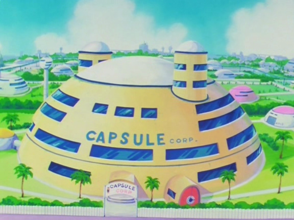

# Capsule

A CSS-only Hugo theme using the Bulma CSS framework and Font-Awesome icons.



# Install

From the base of your website, run: 

```
git submodule add https://github.com/pseudorook/capsule themes/capsule
```

You can then either build Hugo on the command line and pass the `-t capsule`
flag, or you can add `theme = "capsule"` to your config.toml file. 


# Build

To (re)build the CSS, you need to have npm and gulp installed. Clone the
capsule repository and once in it run:

```
npm install
```

and then

```
gulp
```


## Notes: 

### 1. Synatx highlighting (via pygments)

For code blocks, pick the highlighter style in config.toml by setting: 
```
pygmentsstyle = "<style>"
```

For dark highlighter themes, you should rebuild capsule css with
`build/extra/syntax.sass`. Uncomment it from the capsule.sass file and run
`gulp`. 

Without that file, the background color will default to Bulma's light
background-color, and colored elements from dark themes will be hard to read
against it.


### 2. Unused classes in Bulma. 

Capsule is set to only compile the classes it needs. To enable more Bulma
classes, uncomment the relevant sass files in `build/bulma/bulma.sass`.


### 3. Enable automatic generation of nav menus

In your config.toml files, set:

```
SectionPagesMenu = "main"
```

With this set, capsule with automatically generate a navigation menu in the
navbar based on all the sections (the directories inside the content/
directory) present in your site. 
